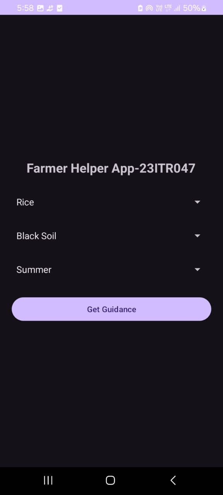
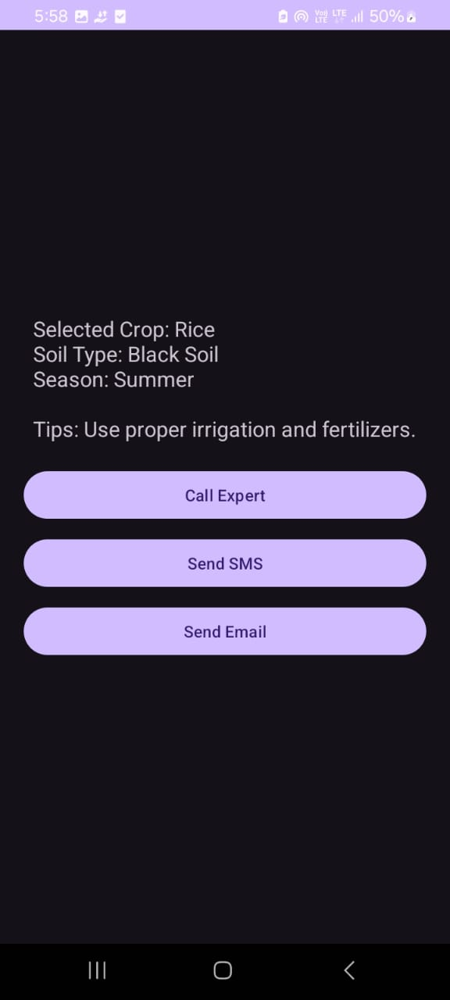
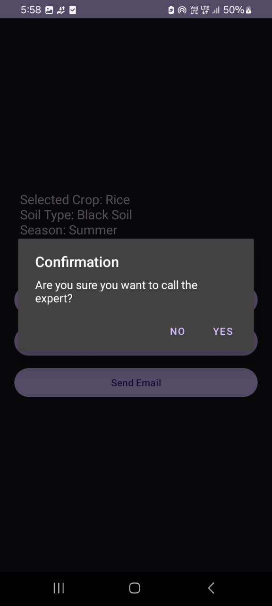

FARMER HELPER APP- 732923ITR047
4 .Problem Statement
Farmers often face difficulty in selecting the right crop based on soil type and season. Many farmers do not have easy access to agricultural experts for guidance. Lack of proper information may lead to poor crop yield and financial loss.
The Farmer Helper App is developed to provide basic crop guidance based on selected crop, soil type, and season. It also allows farmers to easily contact an agricultural expert through call, SMS, or email with confirmation dialogs before performing these actions.

Objectives
• To provide basic crop guidance based on crop, soil, and season
• To create a simple and user-friendly Android interface
• To allow communication with agricultural experts
• To implement telephony features safely with confirmation dialogs
• To demonstrate multi-activity navigation using Intent

Component / Concept	Purpose
Spinner	Lets user choose one item from a list.
Button	Clickable element to do an action.
TextView	Shows text on screen.
Intent (Explicit Intent)	Moves from one screen to another.
AlertDialog	Pop-up to confirm an action.
ACTION_CALL	Makes a phone call.
ACTION_SENDTO	Sends an SMS.
ACTION_SEND	Sends an email or message.
Android Permissions	Needed for call, SMS, or other sensitive actions.
LinearLayout	Arranges elements in a row or column.
Toast	Shows a small message on screen.
## OUTPUT

